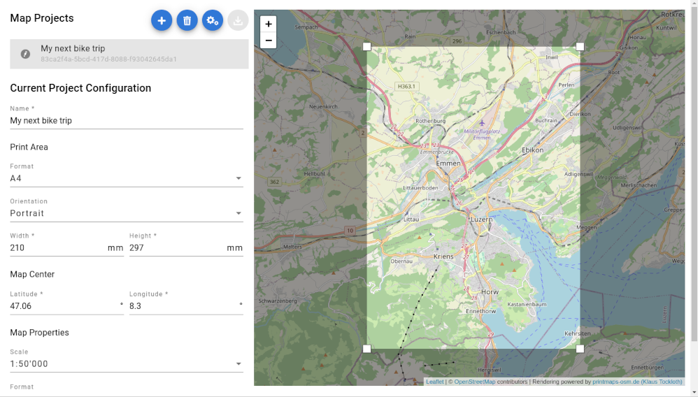

# Web UI for Printmaps Service

This project aims to provide an intuitive Web UI for the printmaps service provided by Klaus Tockloth at
[http://printmaps-osm.de]().



# Installation

## Prerequisites

* Web server (e.g. Apache httpd)
* A directory configured so that it serves it's content.

For Apache httpd this might be something like, assuming that the folder you want ot use is `/opt/printmaps`

```
  Alias "/" "/opt/printmaps"

  <Directory "/opt/printmaps">
    Order allow,deny
    Allow from all
    Require all granted
  </Directory>

  <LocationMatch "^/$">
    <IfModule mod_headers.c>
      FileETag None
      Header unset ETag
      Header unset Pragma
      Header unset Cache-Control
      Header unset Last-Modified
      Header set Pragma "no-cache"
      Header set Cache-Control "max-age=0, no-cache, no-store, must-revalidate"
      Header set Expires "Mon, 10 Apr 1972 00:00:00 GMT"
    </IfModule>
  </LocationMatch>

  RewriteEngine on

  RewriteCond %{HTTP:Accept-Language} (de|fr|en)
  RewriteRule .? - [E=LANG:%1,S=1]
  RewriteRule .? - [E=LANG:en]

  RewriteCond %{DOCUMENT_ROOT}/%{ENV:LANG}%{REQUEST_URI} -f
  RewriteRule ^ /%{ENV:LANG}%{REQUEST_URI} [L]

  RewriteRule ^/$ /%{ENV:LANG}/index.html
```

## Installation Procedure

The Printmaps UI can be deployed with the following steps to any web server:

1. Download the latest runtime version (printmaps-ui-x.x.x.zip)
   from [GitHib Releases](https://github.com/lweller/printmaps-ui/releases)
1. Unpack the archive inside a folder accessible through http or https (e.g. `/opt/printmaps` as suggested above).
1. Create a configuration file named `conf/config.json` by copying the `conf/config.sample.json` provided.

# Development

## Prerequisites

* Fully functional Angular 12 development environment (see https://angular.io/guide/setup-local)
* Optionally, an IDE supporting Angular development (e.g. IntelliJ)

## Getting Started

1. Clone repository from GitHub
1. Create a configuration file named `local/config.json` by copying the `conf/config.sample.json` provided.
1. Run locally with `ng serve -o`

Normally the Printmaps should now be opened in your web browser.

# Change Log

## Version 0.0.3

* Definition of user defined texts on top of the map
* Added tooltips for map project states and actions
* Added German and French translations
* Defined PNG as standard format for new map projects
* Fixed action not triggered when not clicking in the center zone of a button
* Fixed issue when rendering is launched before the project has been saved

## Version 0.0.2

* Fixed production build (code optimisation)
* Extracted config into a separate modifiable file
* Added some notes about installation and development

## Version 0.0.1

* Initial alpha version providing simple selection of an area on a map and allowing to render it

[](https://opensource.org/licenses/Apache-2.0)